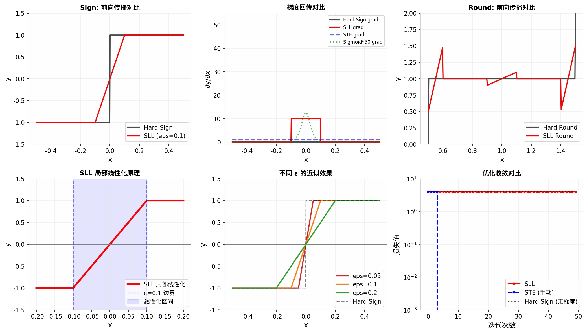

<div align="center">

# 🔷 SLL-Core: Static Local Linearization

**离散程序的零侵入可微分化引擎**

[](https://pypi.org/project/sll-core/)
[](https://github.com/jacksong-sourse/sll-core/blob/main/LICENSE)
[](https://pypi.org/project/sll-core/)
[](https://github.com/jacksong-sourse/sll-core/actions)
[](https://codecov.io/gh/jacksong-sourse/sll-core)

<p align="center">
  <a href="./README.md">中文</a> | <a href="./README_EN.md">English</a>
</p>

</div>

---

## 🤯 问题：为什么离散程序无法自动求导？

在深度学习里，离散决策无处不在：

- **量化**：`round(x)`、`floor(x)`
- **阈值判断**：`sign(x)`、`x > 0`
- **分类选择**：`argmax(x)`

但这些操作有一个致命特性：梯度几乎处处为零，导致标准反向传播直接失效。

```python
x = torch.tensor([0.5], requires_grad=True)
y = torch.sign(x)   # ❌ 梯度为 0，参数永远更新不了
loss = (y - target).pow(2).sum()
loss.backward()
print(x.grad)       # tensor([0.]) ← 死了
```

### 传统方案的缺点

| 方法 | 是否需要改代码 | 部署有残留 | 梯度质量 | 收敛稳定性 |
|------|---------------|------------|----------|------------|
| 硬函数直接训练 | ✅ 无需改动 | ✅ 无残留 | ❌ 零梯度，无法训练 | ❌ 完全不收敛 |
| Sigmoid / Softmax 松弛 | ❌ 重写模型 | ❌ 有近似误差 | ⚠️ 梯度消失/爆炸 | ⚠️ 调参困难 |
| Straight-Through Estimator (STE) | ❌ 手写自定义梯度 | ✅ 无残留 | ⚠️ 梯度方向不准 | ⚠️ 容易震荡 |
| 重参数化/Gumbel-Softmax | ❌ 改模型结构 | ❌ 有温度参数残留 | ⚠️ 高方差 | ⚠️ 慢 |
| ⭐ SLL (静态局部线性化) | ✅ 零侵入 | ✅ 严格恢复硬逻辑 | ✅ 常数梯度，无消失 | ✅ 稳定收敛 |

**SLL 的核心洞察**：不需要在整个定义域上做近似，只在决策边界附近 ε-区间局部线性化，其余区域保持原始硬逻辑。当 `ε → 0` 时，最优解收敛到原始离散问题的最优解。

---

## ⚡ 一句话解决

```python
import torch
import sll

x = torch.tensor([-1.0, 0.0, 1.0], requires_grad=True)

with sll.linearize(eps=1e-2):     # ← 就这行
    y = torch.sign(x)              # 自动可微！
    z = torch.round(y * 10)
    loss = z.sum()
    loss.backward()

print(x.grad)                      # 梯度正常回传 ✅
```

离开上下文后，`torch.sign` 自动恢复原始硬逻辑——训练时可微，部署时零开销。

---

## 🚀 安装

```bash
pip install sll-core
```

**要求**: Python ≥ 3.8，PyTorch ≥ 1.9.0

---

## 🎯 快速开始

### 方式一：自动发现（推荐）

运行时自动探测并软化离散操作：

```python
import torch
import sll

@sll.auto_discover(eps=1e-3)
def my_custom_algorithm(x):
    mask = my_complex_threshold(x)  # 自动发现并软化
    idx = my_custom_selector(x)     # 自动发现并软化
    y = torch.sign(x)               # 自动发现并软化
    return mask, idx, y

x = torch.tensor([-0.5, 0.5], requires_grad=True)
y = my_custom_algorithm(x)
y.sum().backward()                  # 梯度正常回传 ✅
```

### 方式二：黑名单机制

指定不需要软化的函数：

```python
@sll.auto_discover(eps=1e-3, skip=['my_complex_threshold'])
def algorithm_with_exceptions(x):
    mask = my_complex_threshold(x)  # 跳过，保持硬逻辑
    y = torch.sign(x)               # 自动软化
    return mask, y
```

### 方式三：硬模式上下文

局部强制硬逻辑：

```python
@sll.auto_discover(eps=1e-3)
def mixed_mode(x):
    y = torch.sign(x)  # 自动软化
    with sll.hard_mode():
        z = my_custom_selector(x)  # 强制硬逻辑
    return y + z
```

### 方式四：上下文管理器

```python
with sll.linearize(eps=1e-2):
    y = torch.sign(x)
    z = torch.round(y * 10)
    loss = z.sum()
    loss.backward()
```

### 方式五：装饰器

```python
@sll.enable(eps=1e-2)
def quantized_model(x):
    quantized = torch.round(x * 2) / 2
    return torch.sign(quantized)
```

---

## 📊 SLL 为什么更好？

### 梯度质量对比

|      | 硬函数 | STE | Sigmoid 松弛 | SLL |
|------|--------|-----|-------------------|-----|
| 前向输出 | `[-1, 0, 1]` | `[-1, 0, 1]` | 连续值（有误差） | 精确硬输出 |
| 边界附近梯度 | `0` | `1`（常数） | 高斯峰（易消失） | 常数 `1/(2ε)` |
| 远离边界梯度 | `0` | `1 ≈ 0` | `0` | `0`（硬逻辑） |
| 是否需要调温度参数 | — | — | 需要调 `β` | 无需调参 |

### 可视化对比

<p align="center">
  
</p>

上图展示了：

1. **左上**：SLL 在 `|x| > ε` 时严格等于硬 Sign，在边界附近平滑过渡
2. **中上**：SLL 梯度在边界区间内为常数，无 Sigmoid 式梯度消失问题
3. **右上**：SLL Round 在整数点附近线性过渡，远离边界完全等于硬 Round
4. **左下**：SLL 只在 `[-ε, ε]` 区间做局部线性化，其余区域不受影响
5. **中下**：`ε` 越小越接近硬函数，`ε` 越大过渡越平滑
6. **右下**：SLL 可以稳定收敛，硬函数完全无法优化

---

## 📋 支持的可微离散算子

| 算子 | 描述 | 使用示例 |
|------|------|----------|
| `heaviside` | Heaviside 阶跃函数 | `sll.heaviside(x)` |
| `sign` | 符号函数 | `sll.sign(x)` |
| `round` | 四舍五入 | `sll.round(x)` |
| `floor` | 向下取整 | `sll.floor(x)` |
| `ceil` | 向上取整 | `sll.ceil(x)` |
| `threshold` | 通用阈值函数 | `sll.threshold(x, threshold=0.5)` |
| `argmax` | Soft one-hot 编码 | `sll.argmax(x, dim=1)` |
| `soft_where` | 软条件选择 | `sll.soft_where(condition, x, y)` |
| `soft_for` | 软循环操作 | `sll.soft_for(func, x, n_iterations)` |

---

## 🔬 实际应用场景

### 场景 1：量化感知训练 (QAT)

```python
import torch
import sll

def quantize(x, levels=256):
    scale = (levels - 1) / (x.max() - x.min() + 1e-10)
    return torch.round((x - x.min()) * scale) / scale + x.min()

x = torch.randn(10, requires_grad=True)

with sll.linearize(eps=1e-3):
    y = quantize(x)                 # 量化操作可微了！
    loss = y.sum()
    loss.backward()

print("量化梯度:", x.grad)          # ✅ 梯度正常回传
```

### 场景 2：带硬阈值激活的网络

```python
import torch
import torch.nn as nn
import sll

class DiscreteModel(nn.Module):
    def __init__(self):
        super().__init__()
        self.linear = nn.Linear(10, 5)

    def forward(self, x):
        x = self.linear(x)
        return (x > 0).float()          # 硬阈值，原本不可微

model = DiscreteModel()
optimizer = torch.optim.Adam(model.parameters(), lr=1e-3)

# 用 SLL 训练——模型代码完全不用改！
with sll.linearize(eps=1e-2):
    y = model(x)
    loss = (y - target).pow(2).sum()

optimizer.zero_grad()
loss.backward()
optimizer.step()
```

---

## 🧮 数学原理

SLL 在离散决策边界附近建立局部线性化区间：

1. **入口处理**：硬边界替换为 ε-局部线性函数
2. **可微计算**：边界附近使用线性近似，保证处处可微
3. **梯度回传**：边界附近导数为常数，无梯度消失
4. **出口恢复**：严格恢复原始硬逻辑，部署零开销

以 Heaviside 阶跃函数为例：

$$
y(x) = 
  \begin{cases}
    0.5 + x/(2\epsilon) & 当 |x| \leq \epsilon \\
    H(x) & 其他
  \end{cases}
$$

其中 `H(x)` 是原始 Heaviside 函数。当 `ε → 0` 时，`y(x) → H(x)`，最优解收敛到原始问题最优解。

---

## ⚙️ 参数说明

- `eps`：线性化区间半宽，默认 `1e-3`
   - 输入距离硬边界 ≤ `eps`：使用线性化近似
   - 输入距离硬边界 > `eps`：使用原始硬逻辑
   - `eps` 越小，越接近硬逻辑，梯度区域越窄
   - `eps` 越大，过渡越平滑，近似区域越宽

---

## ⚠️ 注意事项

1. **Tensor 方法建议**：`x.sign()` 等 Tensor 方法 SLL 会尽力拦截，但建议用 `torch.sign(x)` 确保一致性
2. **比较运算符**：Python 比较（如 `x > 0`）无法被拦截，建议用 `sll.threshold(x)` 替代
3. **部署阶段**：训练完成后直接部署原始代码，无需加载 SLL，零性能损失
4. **ε 选择**：建议从 `1e-2` 开始，根据任务收敛情况微调

---

## 🏛️ 项目结构

```
sll-core/
├── sll/
│   ├── __init__.py          # 模块导出
│   ├── core.py              # 核心 API（auto_discover, hard_mode）
│   ├── discovery.py         # 运行时离散探测引擎
│   ├── softener.py          # 自动软化层
│   └── ops.py               # SLL 算子实现
├── tests/
│   ├── test_discovery.py    # 离散探测测试
│   ├── test_edge_cases.py   # 边缘案例测试
│   ├── test_gradcheck.py    # 梯度检查测试
│   └── test_ops.py          # 算子测试
├── README.md
├── README_EN.md
├── LICENSE
└── pyproject.toml
```

---

## 📄 许可证

MIT License

---

## 🤝 贡献

欢迎提交 Issue 和 Pull Request！

### 开发环境

```bash
git clone https://github.com/jacksong-sourse/sll-core.git
cd sll-core
pip install -e ".[dev]"
```

### 运行测试

```bash
pytest tests/ -v
```

---

## 📚 引用

如果您在研究中使用 SLL，请引用：

```bibtex
@software{sll-core,
  title = {SLL-Core: Static Local Linearization for Differentiable Discrete Programming},
  author = {Jackson Guo},
  year = {2024},
  url = {https://github.com/jacksong-sourse/sll-core},
}
```
