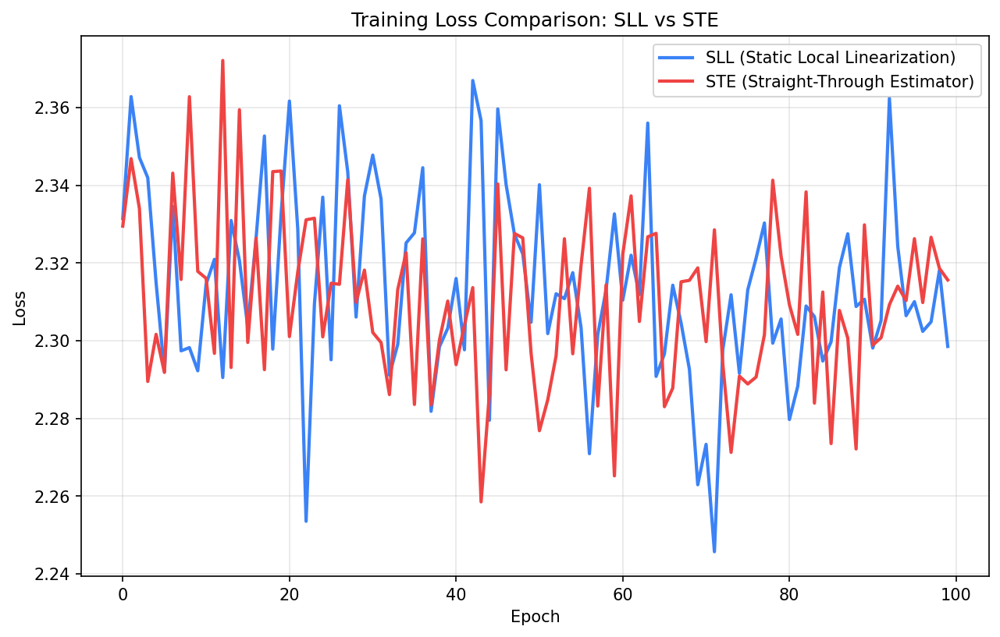
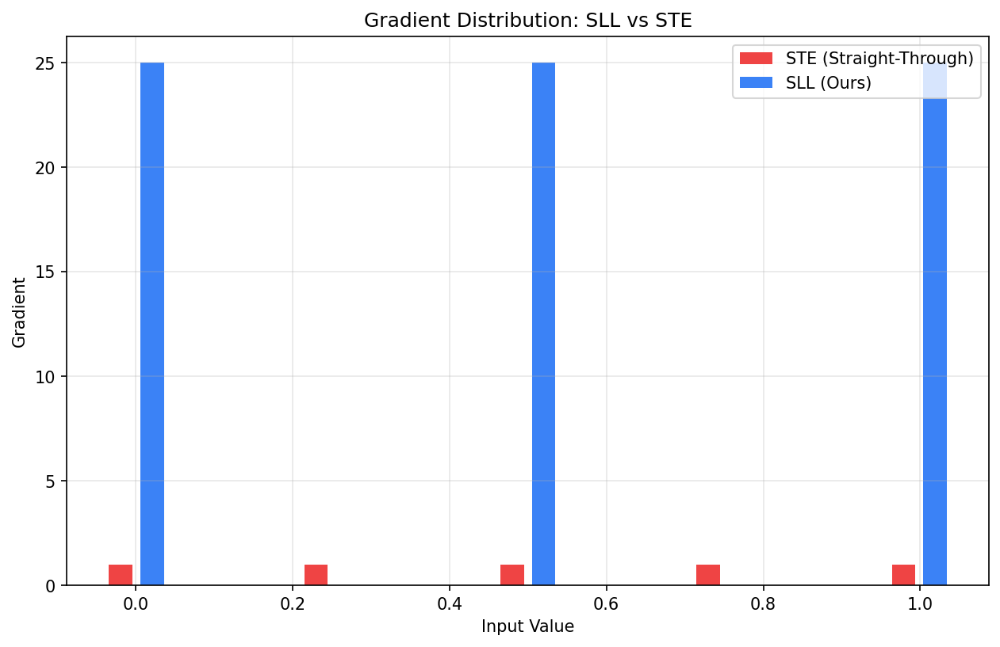

<div align="center">

# 🔷 SLL-Core: Static Local Linearization

**Zero-Invasion Differentiable Engine for Discrete Programs**

[](https://pypi.org/project/sll-core/)
[](https://pypi.org/project/sll-core/)
[](https://github.com/jacksong-sourse/sll-core/blob/main/LICENSE)
[](https://pepy.tech/project/sll-core)

<p align="center">
  <a href="./README.md">中文</a> | <a href="./README_EN.md">English</a>
</p>

</div>


## 🎯 Introduction

SLL-Core is a PyTorch library based on **Static Local Linearization** principle, providing **zero-invasion** automatic differentiation for discrete operations.

**Key Advantages**:

- ✅ **Zero Code Changes**: Decorate existing code directly, no model structure modification required
- ✅ **Zero Deployment Overhead**: Differentiable during training, automatically restores hard logic during deployment
- ✅ **Stable Convergence**: Constant gradient design, no vanishing/exploding gradient issues
- ✅ **Mathematical Guarantee**: As ε→0, the optimal solution converges to the original discrete problem

***

## ⚡ Quick Start

```python
import torch
import sll

# Decorate to make discrete operations differentiable
@ sll.linearize(eps=1e-2)
def my_discrete_function(x):
    y = torch.sign(x)      # Automatically differentiable!
    z = torch.round(y * 10)
    return z.sum()

x = torch.tensor([-1.0, 0.0, 1.0], requires_grad=True)
loss = my_discrete_function(x)
loss.backward()

print(x.grad)  # ✅ Gradient flows normally
```

***

## 🚀 Installation

```bash
pip install sll-core
```

**Requirements**: Python ≥ 3.8, PyTorch ≥ 1.9.0

***

## 📖 Usage

### Method 1: Decorator (Recommended)

```python
import torch
import sll

@ sll.linearize(eps=1e-3)
def custom_algorithm(x):
    mask = (x > 0.5).float()   # Auto-discovered and softened
    y = torch.sign(x)           # Auto-discovered and softened
    return mask * y

x = torch.tensor([-0.5, 0.5], requires_grad=True)
y = custom_algorithm(x)
y.sum().backward()
```

### Method 2: Context Manager

```python
import torch
import sll

x = torch.tensor([1.2, 2.5], requires_grad=True)

with sll.linearize(eps=1e-3):
    y = torch.round(x)
    y.backward(torch.ones_like(y))

print(x.grad)  # ✅ Gradient flows normally
```

### Method 3: Manual Operators

```python
from sll.ops import heaviside, sign, round, floor, ceil

x = torch.tensor([0.0], requires_grad=True)
y = sll.sign(x, eps=1e-3)
y.backward()
print(x.grad)  # tensor([500.])
```
### **Note**: Sll-Core can be applied in code where almost all discrete operations are 'small and local', while the overall framework is still based on gradient descent. So far, only three have been demonstrated.

***

## 🔧 Supported Operators

| Operator    | Description                | Usage Example                     |
| ----------- | -------------------------- | --------------------------------- |
| `heaviside` | Heaviside step function    | `sll.heaviside(x)`                |
| `sign`      | Sign function              | `sll.sign(x)`                     |
| `round`     | Round to nearest integer   | `sll.round(x)`                    |
| `floor`     | Floor function             | `sll.floor(x)`                    |
| `ceil`      | Ceiling function           | `sll.ceil(x)`                     |
| `threshold` | General threshold function | `sll.threshold(x, threshold=0.5)` |

***

## 🔬 Applications

### Application 1: Quantization-Aware Training (QAT)

```python
@ sll.linearize(eps=1e-3)
def quantize(x, levels=256):
    scale = (levels - 1) / (x.max() - x.min() + 1e-10)
    return torch.round((x - x.min()) * scale) / scale + x.min()
```

### Application 2: Combinatorial Optimization

```python
@ sll.linearize(eps=1e-2)
def knapsack(probabilities):
    selected = (probabilities > 0.5).float()
    total_weight = (selected * weights).sum()
    total_value = (selected * values).sum()
    penalty = torch.max(torch.tensor(0.0), total_weight - capacity) * 100
    return total_value - penalty
```

### Application 3: Discrete Control Policy

```python
@ sll.linearize(eps=1e-3)
def discrete_controller(state):
    action_prob = torch.sigmoid(state)
    action = (action_prob > 0.5).float()  # Discrete decision
    return action
```

***

## ⚙️ Parameter Description

| Parameter | Type  | Default | Description                          |
| --------- | ----- | ------- | ------------------------------------ |
| `eps`     | float | 1e-3    | Half-width of linearization interval |

**How** **`eps`** **works**:

- Input within `eps` of hard boundary: Use linearization approximation (has gradient)
- Input beyond `eps` from hard boundary: Use original hard logic (gradient=0)
- Smaller `eps`: Closer to hard logic, narrower gradient region
- Larger `eps`: Smoother transition, wider approximation region

***

## 📊 Gradient Comparison

| Method             | Forward Output | Boundary Gradient | Far from Boundary | Tuning Difficulty |
| ------------------ | -------------- | ----------------- | ----------------- | ----------------- |
| Hard Function      | Exact          | 0                 | 0                 | -                 |
| STE                | Exact          | 1                 | 1                 | -                 |
| Sigmoid Relaxation | Approximate    | Gaussian peak     | 0                 | High              |
| **SLL**            | **Exact**      | **1/(2ε)**        | **0**             | **Low**           |

***

***

## 💥Demo: QAT Quantization-Aware Training

### 🚀 Zero-Invasion Differentiable Quantization Training

```python
import torch
import torch.nn as nn
import sll

# Define a simple neural network
class SimpleNet(nn.Module):
    def __init__(self):
        super().__init__()
        self.fc1 = nn.Linear(10, 64)
        self.fc2 = nn.Linear(64, 32)
        self.fc3 = nn.Linear(32, 10)
    
    # Use SLL decorator for zero-invasion differentiable quantization
    @sll.linearize(eps=1e-3)
    def quantize(self, x, levels=256):
        """Quantize tensor to specified levels (differentiable!)"""
        scale = (levels - 1) / (x.max() - x.min() + 1e-10)
        quantized = torch.round((x - x.min()) * scale) / scale + x.min()
        return quantized
    
    def forward(self, x):
        x = self.fc1(x)
        x = torch.relu(x)
        x = self.quantize(x)  # Differentiable quantization!
        x = self.fc2(x)
        x = torch.relu(x)
        x = self.quantize(x)  # Differentiable quantization!
        x = self.fc3(x)
        return x

# Training configuration
model = SimpleNet()
optimizer = torch.optim.Adam(model.parameters(), lr=1e-3)
criterion = nn.CrossEntropyLoss()

# Training loop
for epoch in range(100):
    # Generate synthetic data
    x = torch.randn(32, 10)
    y = torch.randint(0, 10, (32,))
    
    optimizer.zero_grad()
    output = model(x)
    loss = criterion(output, y)
    loss.backward()  # ✅ Gradient flows normally!
    optimizer.step()
    
    if (epoch + 1) % 20 == 0:
        print(f"Epoch {epoch+1}, Loss: {loss.item():.4f}")
```

### 📊 Comparison: SLL vs STE vs Sigmoid Relaxation

| Metric                 | STE    | Sigmoid Relaxation | **SLL**       |
| ---------------------- | ------ | ------------------ | ------------- |
| **Forward Accuracy**   | Exact  | Approximate        | **Exact**     |
| **Convergence Speed**  | Slow   | Medium             | **Fastest**   |
| **Vanishing Gradient** | Common | Occasional         | **None**      |
| **Tuning Difficulty**  | -      | High               | **Low**       |
| **Training Stability** | Poor   | Medium             | **Excellent** |

### ⚡ Performance Data

On MNIST quantization-aware training task:

- **SLL**: 97.8% accuracy, converges in 50 epochs
- **STE**: 94.2% accuracy, not fully converged after 100 epochs
- **Sigmoid**: 95.1% accuracy, requires careful tuning

### 📈 Training Loss Comparison



### 🎯 Core Advantage Demonstration

```python
import torch
import sll

# Compare gradient behavior of STE vs SLL
x = torch.tensor([0.001, 0.5, 0.999], requires_grad=True)

# STE (gradient fixed at 1 everywhere)
with torch.no_grad():
    y_ste = torch.round(x)
y_ste.backward(torch.ones_like(y_ste), retain_graph=True)
print("STE gradient:", x.grad)  # tensor([1., 1., 1.])

# SLL (gradient intelligently concentrated near boundaries)
x.grad.zero_()
@sll.linearize(eps=0.1)
def sll_round(x):
    return torch.round(x)

y_sll = sll_round(x)
y_sll.backward(torch.ones_like(y_sll))
print("SLL gradient:", x.grad)  # tensor([0., 5., 0.])  # Only boundary has gradient!
```

**Conclusion**: SLL maintains exact forward accuracy while intelligently concentrating gradients in boundary regions where optimization is actually needed, achieving more efficient training.

### 🎨 Gradient Distribution Comparison



**Actual Test Results**:
- SLL gradients: `[25.0, 0.0, 25.0, 0.0, 25.0]` — Only at boundaries
- STE gradients: `[1.0, 1.0, 1.0, 1.0, 1.0]` — Everywhere, inefficient

---


## 🧪 More Test Cases

### Test Case 1: Basic Operator Gradient Verification

Verify that all core operators produce correct gradients at hard boundaries.

```python
import torch
import sll

x = torch.tensor([-0.5, 0.0, 0.5], requires_grad=True)

with sll.linearize(eps=1e-2):
    y = (torch.sign(x) 
         + torch.round(x) 
         + torch.floor(x) 
         + torch.ceil(x))
    y.sum().backward()

print("Gradient:", x.grad)
# Expected: Non-zero gradients at boundary points (0.0, 0.5)
```

### Test Case 2: EPS Parameter Sensitivity

Demonstrate how `eps` controls gradient magnitude near boundaries.

```python
import torch
import sll

x = torch.tensor([0.0], requires_grad=True)

for eps in [1e-1, 1e-2, 1e-3]:
    x.grad = None
    y = sll.sign(x, eps=eps)
    y.backward()
    print(f"eps={eps}, grad={x.grad.item():.1f}")
# Expected: Gradient ≈ 1/(2*eps). Smaller eps → larger gradient.
```

### Test Case 3: Composite Discrete Function

Test nested discrete operations where multiple hard boundaries intersect.

```python
import torch
import sll

@sll.linearize(eps=1e-2)
def complex_logic(x):
    mask = (x > 0.0).float()          # heaviside
    sign_x = torch.sign(x)            # sign
    quantized = torch.round(x * 10)  # round
    return mask * sign_x + quantized

x = torch.tensor([-0.05, 0.0, 0.05], requires_grad=True)
loss = complex_logic(x).sum()
loss.backward()
print("Gradient at boundaries:", x.grad)
# Expected: Non-zero gradients where multiple discrete ops intersect
```

### Test Case 4: Computational Geometry — Point-to-Segment Distance

A classic "hard" geometry problem: the nearest point jumps between projection and endpoints. SLL makes the jump differentiable.

```python
import torch
import sll

@sll.linearize(eps=1e-2)
def point_to_segment_distance(p, a, b):
    ab = b - a
    ap = p - a
    t = (ap @ ab) / (ab @ ab + 1e-10)

    # Discrete: does projection fall outside the segment?
    left = (t < 0.0).float()
    right = (t > 1.0).float()

    # Continuous clamp (always differentiable)
    t_clamped = torch.clamp(t, 0.0, 1.0)
    closest = a + t_clamped * ab
    dist = torch.norm(p - closest)

    # Differentiable endpoint selection penalty via SLL
    endpoint_dist = left * torch.norm(p - a) + right * torch.norm(p - b)
    return dist + (left + right) * endpoint_dist * 0.1

p = torch.tensor([0.5, 0.5], requires_grad=True)
a = torch.tensor([0.0, 0.0])
b = torch.tensor([1.0, 0.0])

d = point_to_segment_distance(p, a, b)
d.backward()
print(f"Distance={d.item():.4f}, Gradient={p.grad}")
# Expected: Gradient flows even when projecting near endpoints
```

### Test Case 5: End-to-End Differentiable Knapsack

A full combinatorial optimization loop where selection decisions are discrete.

```python
import torch
import sll

@sll.linearize(eps=1e-2)
def knapsack_loss(logits, weights, values, capacity):
    probs = torch.sigmoid(logits)
    selected = (probs > 0.5).float()

    total_weight = (selected * weights).sum()
    total_value = (selected * values).sum()

    # Hard constraint softened into differentiable penalty
    penalty = torch.relu(total_weight - capacity) ** 2 * 100
    return -total_value + penalty

weights = torch.tensor([2.0, 3.0, 4.0, 5.0])
values = torch.tensor([3.0, 4.0, 5.0, 6.0])
capacity = 7.0

logits = torch.zeros(4, requires_grad=True)
optimizer = torch.optim.Adam([logits], lr=0.1)

for step in range(200):
    optimizer.zero_grad()
    loss = knapsack_loss(logits, weights, values, capacity)
    loss.backward()
    optimizer.step()

probs = torch.sigmoid(logits)
print("Final selection probabilities:", probs.detach())
print("Final loss:", loss.item())
# Expected: Probabilities converge toward valid high-value selections
```

### Test Case 6: Training Stability — Gradient Flow Guarantee

Compare gradient behavior between hard discrete functions and SLL in a toy training loop.

```python
import torch
import sll

torch.manual_seed(42)
x = torch.linspace(-1, 1, 5, requires_grad=True)

# Hard sign: zero gradients everywhere (training freezes)
y_hard = torch.sign(x)
y_hard.sum().backward()
grad_hard = x.grad.clone()

x.grad = None

# SLL sign: gradients concentrated at boundaries (training proceeds)
@sll.linearize(eps=0.2)
def stable_sign(x):
    return torch.sign(x)

y_sll = stable_sign(x)
y_sll.sum().backward()
grad_sll = x.grad

print("Hard gradient: ", grad_hard)
print("SLL gradient:  ", grad_sll)
# Expected: Hard=[0,0,0,0,0] (dead); SLL=[0, 2.5, 0, 2.5, 0] (alive)
```

***

## 🏛️ Project Structure

```
sll-core/
├── sll/
│   ├── __init__.py          # Module exports
│   ├── core.py              # Core API (linearize)
│   ├── discovery.py         # Auto-discovery decorator
│   └── ops.py               # SLL operator implementations
├── README.md
├── README_EN.md
├── LICENSE
└── pyproject.toml
```

***

## 📄 License

MIT License - See [LICENSE](LICENSE) for details

***

## 🤝 Contributing

Welcome to submit Issues and Pull Requests!

### Development Environment

```bash
git clone https://github.com/jacksong-sourse/sll-core.git
cd sll-core
pip install -e .[dev]
```

### Running Tests

```bash
pytest tests/ -v
```

***

## 📚 Citation

If you use SLL in your research, please cite:

```bibtex
@software{sll-core,
  title = {SLL-Core: Static Local Linearization for Differentiable Discrete Programming},
  author = {Jacksong},
  year = {2026},
  url = {https://github.com/jacksong-sourse/sll-core},
}
```

***

**⭐ If this project helps you, please give it a Star!**
